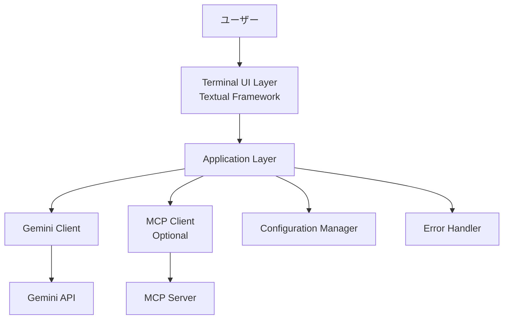
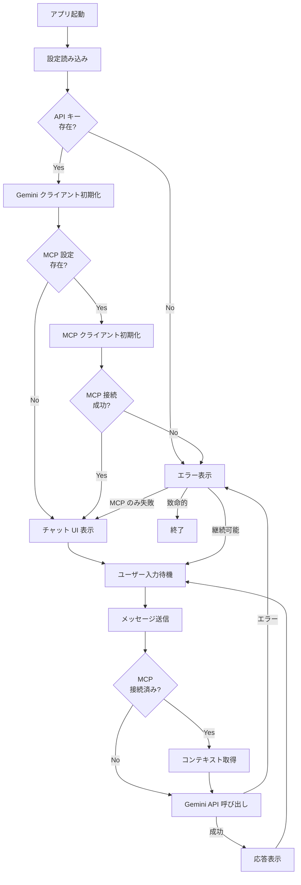
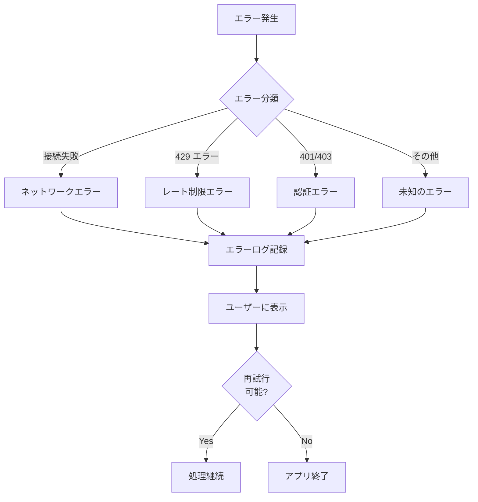

# 技術設計書

## Overview

このアプリケーションは、Gemini API を使用した AI チャット機能と MCP（Model Context Protocol）サーバーとの統合を実現する、Python ベースのターミナル UI アプリケーションです。MVP スコープとして、ユーザーが Gemini AI とターミナル上でチャット形式で対話でき、オプションで MCP サーバー経由のコンテキスト情報を活用できる最小限の機能を提供します。

**Purpose:** エンドユーザーに対して、ターミナル環境で Gemini AI との対話インターフェースを提供し、開発者に対して MCP プロトコルを活用したコンテキスト強化型 AI アプリケーションの実装パターンを示します。

**Users:** 開発者、研究者、CLI ツールを好む技術ユーザーがターミナル環境で AI との対話や MCP サーバーとの統合テストに利用します。

**Impact:** 現状では存在しない Python + Gemini + MCP の統合実装例を提供し、ターミナルベースの AI アプリケーション開発の基盤を構築します。

### Goals

- Gemini API クライアントとの安定した通信を実現する
- MCP サーバーとのオプショナルな接続機能を提供する
- シンプルで直感的なターミナル UI を通じた対話体験を提供する
- API キーとサーバー設定の安全な管理を実現する
- 最小限のエラーハンドリングで堅牢性を確保する

### Non-Goals

- Web ベースの UI（ブラウザインターフェース）
- マルチユーザー機能やユーザー認証システム
- チャット履歴の永続化（データベース保存）
- 複数の AI モデルへの同時接続
- プラグインシステムや拡張機能アーキテクチャ
- 高度な MCP サーバー機能（リソース、プロンプト管理）の実装

## Architecture

### High-Level Architecture



### Architecture Integration

**新規実装のため既存パターンはなし:** このプロジェクトは新規実装であり、既存のアーキテクチャパターンに従う必要はありません。

**新規コンポーネントの選定理由:**

- **Terminal UI Layer (Textual):** Python ネイティブな TUI フレームワークで、リアクティブな UI 構築と非同期処理をサポート
- **Application Layer:** ビジネスロジックを UI と外部サービスから分離し、テスタビリティを向上
- **Gemini Client:** 公式 google-genai SDK を使用し、安定した API 通信を保証
- **MCP Client:** 公式 MCP Python SDK を使用し、標準プロトコル準拠を実現

**技術スタック整合性:** Python 3.10+ エコシステムに統一し、標準的な依存管理（pip/uv）と環境変数ベースの設定を採用

### Technology Stack and Design Decisions

#### Technology Stack

**Runtime:**

- Python 3.10+
- 選定理由: MCP SDK の最小要件に準拠し、型ヒントと async/await の完全サポートを活用
- 代替案: Python 3.9（MCP SDK 非対応）、Go/TypeScript（開発速度とエコシステムで劣る）

**UI Layer:**

- Textual Framework
- 選定理由: リッチな TUI 構築、リアクティブプログラミングモデル、非同期処理ネイティブサポート
- 代替案: Rich（UI フレームワーク機能なし）、curses（低レベル過ぎる）、Gradio/Streamlit（Web ベース）

**AI Integration:**

- google-genai SDK (公式 Python クライアント)
- 選定理由: 公式サポート、GA ステータス（2025年5月）、同期/非同期 API 両対応
- 代替案: 旧 generative-ai-python（2025年11月にサポート終了）、REST API 直接呼び出し（開発コスト高）

**MCP Integration:**

- mcp Python SDK (公式実装)
- 選定理由: 公式標準実装、stdio/SSE トランスポート対応、FastMCP による簡潔な API
- 代替案: 独自プロトコル実装（標準非準拠）、REST API ラッパー（MCP の利点を失う）

**Configuration:**

- python-dotenv + 環境変数
- 選定理由: シンプルな設定管理、API キーの平文保存回避、12-factor app 原則準拠
- 代替案: YAML/JSON 設定ファイル（シークレット管理リスク）、CLI 引数（セキュリティリスク）

#### Key Design Decisions

##### Decision 1: Textual Framework の採用

**Decision:** Textual Framework をターミナル UI の基盤として採用

**Context:** チャットアプリケーションには、メッセージ履歴のスクロール表示、入力フィールド、ローディングインジケーター、MCP 接続状態表示などのインタラクティブな UI コンポーネントが必要です。

**Alternatives:**

1. **Rich:** テキスト装飾とプログレスバーには優れるが、インタラクティブな UI フレームワーク機能がない
2. **curses:** 低レベル API で柔軟性は高いが、開発コストが高く、リアクティブプログラミングモデルがない
3. **Gradio/Streamlit:** Web ベースで機能は豊富だが、ターミナル環境での動作とシンプルさの要件を満たさない

**Selected Approach:** Textual Framework を使用し、Widget システムとリアクティブ変数を活用してチャット UI を構築します。

**Rationale:**

- リアクティブプログラミングモデルにより UI とデータの同期が自動化される
- 非同期処理ネイティブサポートで Gemini API と MCP の async 通信と統合しやすい
- Widget の組み合わせにより、メッセージリスト、入力欄、ステータス表示を効率的に実装できる
- CSS ライクなスタイリングシステムで UI のカスタマイズが容易

**Trade-offs:**

- 獲得: 高速な UI 開発、保守性の向上、非同期処理の統合
- 犠牲: 追加の依存関係（Textual + Rich）、学習コスト

##### Decision 2: MCP クライアントのオプショナル接続設計

**Decision:** MCP サーバー接続を必須ではなくオプショナル機能として設計

**Context:** 要件2.2 により、MCP サーバー接続情報が設定されていない場合でもアプリケーションを起動できる必要があります。また、MCP サーバーの可用性はアプリケーションの動作に影響を与えるべきではありません。

**Alternatives:**

1. **MCP 必須:** MCP サーバーなしでは起動しない設計（要件違反）
2. **完全統合:** MCP を常にメインフローに組み込み、エラー時にフォールバック処理を複雑化
3. **オプショナル設計:** MCP 接続を Optional パラメータとし、接続状態に応じて動作を切り替える

**Selected Approach:** MCP クライアントを Optional 型で定義し、初期化時に設定有無を判定してインスタンス化を決定します。Gemini API 呼び出し時に MCP クライアントの存在を確認し、存在する場合のみコンテキスト情報を取得します。

**Rationale:**

- Gemini API のみの利用ケースでも完全に動作する
- MCP サーバー接続失敗時にアプリケーション全体が停止しない
- 将来的に複数の MCP サーバーをサポートする拡張が容易
- テスト時に MCP サーバーのモック化が簡単

**Trade-offs:**

- 獲得: 堅牢性の向上、柔軟な利用シナリオ、段階的な機能追加
- 犠牲: 条件分岐による若干のコード複雑性、MCP 利用時と非利用時の動作差異

##### Decision 3: 環境変数ベースの設定管理

**Decision:** API キーと MCP サーバー設定を環境変数で管理し、python-dotenv で .env ファイルから読み込む

**Context:** 要件4.4 により、API キーを平文で保存してはならず、セキュアな設定管理が求められます。また、MVP スコープのため設定 UI は実装しません。

**Alternatives:**

1. **設定ファイル (YAML/JSON):** 構造化データは扱いやすいが、API キーの平文保存リスクがある
2. **CLI 引数:** 柔軟性は高いが、シェル履歴に API キーが残るセキュリティリスク
3. **環境変数 + .env:** シンプルで、.gitignore により API キーをリポジトリから除外できる

**Selected Approach:** .env ファイルに設定を記述し、python-dotenv で環境変数として読み込みます。.env.example をテンプレートとして提供します。

**Rationale:**

- 12-factor app の設定原則に準拠
- .env ファイルを .gitignore に追加することで API キーをリポジトリから除外
- CI/CD 環境では環境変数を直接設定可能
- python-dotenv は標準的なライブラリで依存関係が軽量

**Trade-offs:**

- 獲得: セキュリティの向上、標準的なベストプラクティス、環境間の移植性
- 犠牲: 設定変更時にアプリケーション再起動が必要、複雑な設定構造には不向き

## System Flows

### User Interaction Flow



### Error Handling Flow



## Requirements Traceability

| 要件 | 要件概要 | コンポーネント | インターフェース | フロー |
|------|----------|----------------|------------------|--------|
| 1.1 | Gemini API クライアント初期化 | GeminiClient | `initialize()` | User Interaction Flow |
| 1.2 | API キー検証 | ConfigurationManager | `validate_api_key()` | User Interaction Flow |
| 1.3 | メッセージ送信 | GeminiClient | `send_message(message, context)` | User Interaction Flow |
| 1.4 | レスポンス表示 | ChatUI | `display_message(message)` | User Interaction Flow |
| 1.5 | API エラーハンドリング | ErrorHandler | `handle_api_error(error)` | Error Handling Flow |
| 2.1 | MCP サーバー接続 | MCPClient | `connect()` | User Interaction Flow |
| 2.2 | MCP オプショナル起動 | Application | `initialize_mcp(config)` | User Interaction Flow |
| 2.3 | MCP 接続状態表示 | ChatUI | `update_mcp_status(connected)` | User Interaction Flow |
| 2.4 | MCP 接続失敗時の継続 | ErrorHandler | `handle_mcp_error(error)` | Error Handling Flow |
| 2.5 | コンテキスト情報取得 | MCPClient | `get_context()` | User Interaction Flow |
| 3.1-3.6 | チャット UI 表示・操作 | ChatUI | `render()`, `on_message()` | User Interaction Flow |
| 4.1-4.4 | 設定管理 | ConfigurationManager | `load_config()` | User Interaction Flow |
| 5.1-5.4 | エラーハンドリング | ErrorHandler | `handle_error(error, context)` | Error Handling Flow |

## Components and Interfaces

### Application Layer

#### Application

**Responsibility & Boundaries**

- **Primary Responsibility:** アプリケーションのライフサイクル管理とコンポーネント間の調整を行う
- **Domain Boundary:** アプリケーション層全体を統括し、UI 層とサービス層を接続する
- **Data Ownership:** アプリケーション起動時の設定データと実行状態を管理
- **Transaction Boundary:** アプリケーション全体の初期化と終了処理

**Dependencies**

- **Inbound:** ChatUI（ユーザーアクション）
- **Outbound:** ConfigurationManager, GeminiClient, MCPClient, ErrorHandler
- **External:** python-dotenv（環境変数読み込み）

**Contract Definition**

```python
from typing import Optional
from dataclasses import dataclass

@dataclass
class AppConfig:
    gemini_api_key: str
    mcp_server_url: Optional[str]
    mcp_server_transport: str  # "stdio" or "sse"
    log_level: str

class Application:
    def __init__(self, config: AppConfig) -> None:
        """アプリケーションを初期化する"""
        ...

    async def start(self) -> None:
        """アプリケーションを起動する"""
        ...

    async def shutdown(self) -> None:
        """アプリケーションを終了する"""
        ...

    async def handle_user_message(self, message: str) -> str:
        """ユーザーメッセージを処理して応答を返す"""
        ...
```

**Preconditions:**

- `AppConfig` が有効な設定値を持つこと
- `gemini_api_key` が空でないこと

**Postconditions:**

- `start()` 成功時、すべての必須コンポーネントが初期化されている
- `handle_user_message()` 成功時、Gemini API からの応答が返される

**Invariants:**

- アプリケーションライフサイクル中、GeminiClient は常に初期化済み
- MCPClient は設定に応じて初期化されるか、None のまま

#### ConfigurationManager

**Responsibility & Boundaries**

- **Primary Responsibility:** 環境変数と .env ファイルから設定を読み込み、検証する
- **Domain Boundary:** 設定管理ドメイン全体を担当
- **Data Ownership:** API キー、MCP サーバー設定、ログレベルなどの設定データ
- **Transaction Boundary:** 設定読み込みと検証は単一のトランザクション

**Dependencies**

- **Inbound:** Application
- **Outbound:** なし
- **External:** python-dotenv, os.environ

**External Dependencies Investigation:**

**python-dotenv** は環境変数管理の標準的なライブラリです：

- API: `load_dotenv()` で .env ファイルを読み込み、環境変数として設定
- バージョン: 1.0.0+ を推奨（Python 3.10+ サポート）
- 動作: .env ファイルを探索し、`KEY=VALUE` 形式の設定を `os.environ` に追加
- セキュリティ: .env ファイルは .gitignore に追加することで API キーを保護

**Contract Definition**

```python
from typing import Optional
from dataclasses import dataclass

@dataclass
class ConfigValidationError(Exception):
    field: str
    message: str

class ConfigurationManager:
    @staticmethod
    def load_config() -> AppConfig:
        """環境変数から設定を読み込む

        Raises:
            ConfigValidationError: 必須設定が存在しない場合
        """
        ...

    @staticmethod
    def validate_api_key(api_key: str) -> bool:
        """API キーの形式を検証する"""
        ...
```

**Preconditions:**

- .env ファイルが存在するか、環境変数が設定されている

**Postconditions:**

- `load_config()` 成功時、すべての設定が検証済み
- 必須設定が欠如している場合、`ConfigValidationError` が発生

### AI Integration Layer

#### GeminiClient

**Responsibility & Boundaries**

- **Primary Responsibility:** Gemini API との通信を担当し、メッセージ送信と応答受信を管理する
- **Domain Boundary:** AI 統合ドメインの Gemini API 部分
- **Data Ownership:** チャットセッション状態（会話履歴）
- **Transaction Boundary:** 単一のメッセージ送信と応答受信

**Dependencies**

- **Inbound:** Application
- **Outbound:** なし
- **External:** google-genai SDK, Gemini API

**External Dependencies Investigation:**

**google-genai SDK** の主要機能と制約：

- **インストール:** `pip install google-genai`
- **認証:** API キーによる認証（`genai.Client(api_key='...')`）
- **モデル:** Gemini 1.5 Flash, Gemini 1.5 Pro などをサポート
- **API 制限:**
  - 無料枠: 15 requests/minute, 1 million tokens/day（2025年時点）
  - レート制限エラー: HTTP 429 を返す
- **エラータイプ:** `google.api_core.exceptions` モジュールの例外
- **ストリーミング:** `generate_content(..., stream=True)` でストリーミング応答をサポート
- **会話履歴:** `ChatSession` オブジェクトでマルチターン会話を管理
- **要調査事項:** MCP コンテキスト情報の最適な注入方法（システムメッセージ vs ユーザーメッセージの前置）

**Contract Definition**

```python
from typing import Optional, List
from dataclasses import dataclass

@dataclass
class Message:
    role: str  # "user" or "model"
    content: str

@dataclass
class GeminiError(Exception):
    error_type: str  # "network", "rate_limit", "auth", "unknown"
    message: str
    original_error: Optional[Exception]

class GeminiClient:
    def __init__(self, api_key: str, model: str = "gemini-1.5-flash") -> None:
        """Gemini クライアントを初期化する"""
        ...

    async def send_message(
        self,
        message: str,
        context: Optional[str] = None
    ) -> str:
        """メッセージを送信して応答を取得する

        Args:
            message: ユーザーメッセージ
            context: MCP から取得したコンテキスト情報（オプション）

        Returns:
            Gemini API からの応答テキスト

        Raises:
            GeminiError: API 通信エラー
        """
        ...

    def get_conversation_history(self) -> List[Message]:
        """会話履歴を取得する"""
        ...

    async def reset_conversation(self) -> None:
        """会話履歴をリセットする"""
        ...
```

**Preconditions:**

- API キーが有効であること
- インターネット接続が利用可能であること

**Postconditions:**

- `send_message()` 成功時、会話履歴に新しいメッセージペアが追加される
- エラー時、適切な `GeminiError` が発生する

**Invariants:**

- 会話履歴は常にユーザー・モデルのメッセージペアで構成される

#### MCPClient

**Responsibility & Boundaries**

- **Primary Responsibility:** MCP サーバーとの接続を管理し、コンテキスト情報を取得する
- **Domain Boundary:** AI 統合ドメインの MCP プロトコル部分
- **Data Ownership:** MCP サーバー接続状態とコンテキストデータ
- **Transaction Boundary:** 単一のコンテキスト取得リクエスト

**Dependencies**

- **Inbound:** Application
- **Outbound:** なし
- **External:** mcp Python SDK, MCP Server

**External Dependencies Investigation:**

**mcp Python SDK** の主要機能と制約：

- **インストール:** `pip install "mcp[cli]"` または `uv add "mcp[cli]"`
- **バージョン要件:** Python 3.10+ 必須
- **トランスポート:**
  - **stdio:** ローカルプロセスとの通信（推奨）
  - **SSE (Server-Sent Events):** HTTP ベースの通信
- **主要コンセプト:**
  - **Resources:** データの公開（今回は使用しない）
  - **Tools:** 機能の実行（今回は使用しない）
  - **Prompts:** 対話パターン（今回は使用しない）
- **クライアント接続:**

  ```python
  from mcp import ClientSession, StdioServerParameters
  from mcp.client.stdio import stdio_client

  server_params = StdioServerParameters(
      command="python",
      args=["server.py"]
  )
  async with stdio_client(server_params) as (read, write):
      async with ClientSession(read, write) as session:
          await session.initialize()
  ```

- **エラーハンドリング:** 接続エラーは標準的な Python 例外として発生
- **要調査事項:**
  - MCP サーバーから取得するコンテキスト情報のフォーマット（カスタム実装依存）
  - 長時間接続時のタイムアウトと再接続戦略

**Contract Definition**

```python
from typing import Optional
from dataclasses import dataclass

@dataclass
class MCPConfig:
    server_command: str  # e.g., "python"
    server_args: List[str]  # e.g., ["server.py"]
    transport: str  # "stdio" or "sse"

@dataclass
class MCPError(Exception):
    error_type: str  # "connection", "timeout", "protocol"
    message: str

class MCPClient:
    def __init__(self, config: MCPConfig) -> None:
        """MCP クライアントを初期化する"""
        ...

    async def connect(self) -> bool:
        """MCP サーバーに接続する

        Returns:
            接続成功時 True、失敗時 False
        """
        ...

    async def get_context(self) -> Optional[str]:
        """コンテキスト情報を取得する

        Returns:
            コンテキスト文字列、取得失敗時 None

        Raises:
            MCPError: プロトコルエラー
        """
        ...

    async def disconnect(self) -> None:
        """MCP サーバーから切断する"""
        ...

    def is_connected(self) -> bool:
        """接続状態を確認する"""
        ...
```

**Preconditions:**

- MCP サーバーが起動可能であること（stdio の場合）
- MCP サーバーの URL が有効であること（SSE の場合）

**Postconditions:**

- `connect()` 成功時、`is_connected()` が True を返す
- `disconnect()` 実行後、すべてのリソースが解放される

**Invariants:**

- 接続状態は `is_connected()` で常に確認可能

**Integration Strategy:**

- **Modification Approach:** 新規実装のため既存コードの変更なし
- **Backward Compatibility:** 該当なし
- **Migration Path:** 該当なし

### UI Layer

#### ChatUI

**Responsibility & Boundaries**

- **Primary Responsibility:** ターミナル上でチャット UI を表示し、ユーザー入力を受け付ける
- **Domain Boundary:** UI 層全体
- **Data Ownership:** UI 状態（表示中のメッセージ、入力テキスト、MCP 接続状態表示）
- **Transaction Boundary:** 単一のユーザーインタラクション（メッセージ送信、スクロール）

**Dependencies**

- **Inbound:** User（キーボード入力）
- **Outbound:** Application（メッセージ送信）
- **External:** Textual Framework, Rich

**External Dependencies Investigation:**

**Textual Framework** の主要機能：

- **インストール:** `pip install textual`
- **バージョン:** 0.50.0+ 推奨（2025年時点の最新版）
- **コアコンセプト:**
  - **App:** アプリケーションエントリーポイント
  - **Widget:** UI コンポーネント（Button, Input, Static, ListView など）
  - **Reactive:** リアクティブ変数（`reactive()` デコレータ）で UI とデータを同期
  - **Compose:** `compose()` メソッドで Widget ツリーを構築
- **チャット UI に有用な Widget:**
  - `ListView`: メッセージ履歴の表示
  - `Input`: メッセージ入力フィールド
  - `Static`: ステータス表示（MCP 接続状態など）
  - `Footer`: キーバインド表示
- **非同期処理:** `async def on_*()` イベントハンドラで async/await をサポート
- **スタイリング:** CSS ライクな構文でスタイルを定義
- **要調査事項:** ストリーミング応答時の部分的なメッセージ更新パターン

**Contract Definition**

```python
from textual.app import App
from textual.widgets import Input, ListView, Static, Footer
from typing import Callable, Awaitable

class ChatUI(App):
    def __init__(
        self,
        on_message: Callable[[str], Awaitable[str]],
        mcp_connected: bool = False
    ) -> None:
        """チャット UI を初期化する

        Args:
            on_message: メッセージ送信時のコールバック
            mcp_connected: MCP サーバー接続状態
        """
        ...

    def compose(self):
        """UI コンポーネントを構成する"""
        yield Static("Gemini Chat", id="title")
        yield Static(f"MCP: {'Connected' if self.mcp_connected else 'Disconnected'}", id="status")
        yield ListView(id="messages")
        yield Input(placeholder="Type a message...", id="input")
        yield Footer()

    async def on_input_submitted(self, event: Input.Submitted) -> None:
        """ユーザー入力を処理する"""
        ...

    def display_message(self, role: str, content: str) -> None:
        """メッセージを履歴に追加する

        Args:
            role: "user" or "assistant"
            content: メッセージ内容
        """
        ...

    def update_mcp_status(self, connected: bool) -> None:
        """MCP 接続状態を更新する"""
        ...

    def show_loading(self) -> None:
        """ローディングインジケーターを表示する"""
        ...

    def hide_loading(self) -> None:
        """ローディングインジケーターを非表示にする"""
        ...
```

**Preconditions:**

- `on_message` コールバックが有効な async 関数であること
- ターミナル環境が利用可能であること

**Postconditions:**

- ユーザー入力時、`on_message` コールバックが呼び出される
- 応答受信時、メッセージが履歴に追加される

**State Management:**

- **State Model:** アイドル → ローディング → 応答受信 → アイドル
- **Persistence:** 状態は保存せず、アプリケーション終了時に破棄
- **Concurrency:** Textual のイベントループで管理

### Error Handling Layer

#### ErrorHandler

**Responsibility & Boundaries**

- **Primary Responsibility:** すべてのエラーを分類し、適切なログ記録とユーザー表示を行う
- **Domain Boundary:** エラーハンドリングドメイン全体
- **Data Ownership:** エラーログとエラーメッセージ
- **Transaction Boundary:** 単一のエラー処理

**Dependencies**

- **Inbound:** Application, GeminiClient, MCPClient
- **Outbound:** ChatUI（エラー表示）
- **External:** logging モジュール

**Contract Definition**

```python
from enum import Enum
from typing import Optional
from dataclasses import dataclass

class ErrorCategory(Enum):
    NETWORK = "network"
    RATE_LIMIT = "rate_limit"
    AUTH = "auth"
    MCP_CONNECTION = "mcp_connection"
    UNKNOWN = "unknown"

@dataclass
class ErrorContext:
    category: ErrorCategory
    user_message: str
    log_message: str
    recoverable: bool

class ErrorHandler:
    @staticmethod
    def handle_error(error: Exception, context: Optional[str] = None) -> ErrorContext:
        """エラーを処理してコンテキストを返す

        Args:
            error: 発生した例外
            context: エラー発生時のコンテキスト情報

        Returns:
            エラーコンテキスト
        """
        ...

    @staticmethod
    def log_error(error: Exception, context: Optional[str] = None) -> None:
        """エラーをログに記録する"""
        ...

    @staticmethod
    def get_user_message(error: Exception) -> str:
        """ユーザーに表示するエラーメッセージを取得する"""
        ...

    @staticmethod
    def is_recoverable(error: Exception) -> bool:
        """エラーが回復可能かどうかを判定する"""
        ...
```

**Preconditions:**

- ロギングが設定されていること

**Postconditions:**

- すべてのエラーがログに記録される
- ユーザーフレンドリーなエラーメッセージが返される

## Data Models

### Domain Model

このアプリケーションは単純なメッセージング構造を持つため、複雑な Domain Model は不要です。主要なエンティティは以下の通りです。

#### Message (Value Object)

会話のメッセージを表現する不変オブジェクトです。

```python
from dataclasses import dataclass
from datetime import datetime

@dataclass(frozen=True)
class Message:
    role: str  # "user" or "model"
    content: str
    timestamp: datetime

    def __post_init__(self):
        if self.role not in ("user", "model"):
            raise ValueError(f"Invalid role: {self.role}")
```

**Business Rules & Invariants:**

- `role` は "user" または "model" のみ
- `content` は空文字列でない
- `timestamp` は過去の時刻である

#### AppConfig (Value Object)

アプリケーション設定を表現する不変オブジェクトです。

```python
from dataclasses import dataclass
from typing import Optional

@dataclass(frozen=True)
class AppConfig:
    gemini_api_key: str
    mcp_server_command: Optional[str]
    mcp_server_args: Optional[List[str]]
    mcp_transport: str = "stdio"
    log_level: str = "INFO"
    gemini_model: str = "gemini-1.5-flash"

    def has_mcp_config(self) -> bool:
        return self.mcp_server_command is not None
```

**Business Rules & Invariants:**

- `gemini_api_key` は空文字列でない
- `mcp_transport` は "stdio" または "sse"
- `log_level` は Python logging の有効なレベル

### Physical Data Model

このアプリケーションはデータベースを使用せず、すべてのデータはメモリ上で管理されます。

#### In-Memory Storage

**会話履歴:**

- 構造: `List[Message]`
- 保存場所: `GeminiClient` インスタンス内
- ライフサイクル: アプリケーション起動から終了まで
- 制約: メモリ容量に依存（MVP では上限なし）

**設定データ:**

- 構造: `AppConfig` オブジェクト
- 保存場所: `Application` インスタンス内
- ライフサイクル: アプリケーション起動時に読み込み、終了まで不変

#### Configuration File (.env)

```
# Gemini API Configuration
GEMINI_API_KEY=your_api_key_here
GEMINI_MODEL=gemini-1.5-flash

# MCP Server Configuration (Optional)
MCP_SERVER_COMMAND=python
MCP_SERVER_ARGS=server.py
MCP_TRANSPORT=stdio

# Logging
LOG_LEVEL=INFO
```

**Data Contracts & Integration:**

- 環境変数名は `SCREAMING_SNAKE_CASE` 形式
- リスト形式の値（`MCP_SERVER_ARGS`）はカンマ区切りまたはスペース区切り
- オプショナルな設定項目が存在しない場合、アプリケーションはデフォルト動作

## Error Handling

### Error Strategy

このアプリケーションは、エラーを**分類**し、**ログ記録**し、**ユーザーに適切なフィードバック**を提供する戦略を採用します。エラーの回復可能性に基づいて、アプリケーション継続または終了を決定します。

### Error Categories and Responses

#### User Errors (設定エラー)

**Invalid API Key (認証エラー):**

- **検出:** ConfigurationManager による検証、Gemini API の 401/403 レスポンス
- **対応:** エラーメッセージ「API キーが無効です。.env ファイルを確認してください。」を表示し、アプリケーションを終了
- **回復可能性:** 不可（アプリケーション終了）

**Missing Required Configuration:**

- **検出:** ConfigurationManager による検証
- **対応:** エラーメッセージ「必須設定項目が見つかりません: {field_name}」を表示し、アプリケーションを終了
- **回復可能性:** 不可（アプリケーション終了）

#### System Errors (インフラストラクチャエラー)

**Network Error:**

- **検出:** `requests.exceptions.ConnectionError`, `asyncio.TimeoutError`
- **対応:** エラーメッセージ「ネットワーク接続エラーが発生しました。インターネット接続を確認してください。」を表示
- **回復可能性:** 可（ユーザーは再度メッセージを送信可能）
- **ログレベル:** WARNING

**Rate Limit Error (API 制限):**

- **検出:** Gemini API の HTTP 429 レスポンス
- **対応:** エラーメッセージ「API レート制限に達しました。しばらく待ってから再試行してください。」を表示
- **回復可能性:** 可（ユーザーは再度メッセージを送信可能）
- **ログレベル:** WARNING

**MCP Connection Error:**

- **検出:** MCP クライアントの接続失敗
- **対応:** エラーメッセージ「MCP サーバーへの接続に失敗しました。MCP 機能なしで続行します。」を表示し、MCP なしでアプリケーション継続
- **回復可能性:** 可（MCP なしで動作継続）
- **ログレベル:** WARNING

#### Unknown Errors

**Unexpected Error:**

- **検出:** すべての未処理例外
- **対応:** エラーメッセージ「予期しないエラーが発生しました。詳細はログを確認してください。」を表示
- **回復可能性:** 可（ユーザーは再度メッセージを送信可能）
- **ログレベル:** ERROR
- **追加処理:** スタックトレースをログに記録

### Monitoring

**Error Tracking:**

- すべてのエラーは Python 標準の `logging` モジュールを使用してログファイルに記録
- ログファイル: `app.log`（アプリケーションルートディレクトリ）
- ログフォーマット: `%(asctime)s - %(name)s - %(levelname)s - %(message)s`

**Health Monitoring:**

- MCP サーバー接続状態を UI に表示（Connected/Disconnected）
- Gemini API の応答時間をログに記録（デバッグレベル）

**Metrics (将来拡張):**

- メッセージ送信回数
- エラー発生率
- 平均応答時間

## Testing Strategy

### Unit Tests

1. **ConfigurationManager.load_config()**: 環境変数の読み込みと検証ロジック
2. **ErrorHandler.handle_error()**: エラー分類とユーザーメッセージ生成ロジック
3. **GeminiClient.send_message()**: メッセージ送信ロジック（API 呼び出しはモック）
4. **MCPClient.connect()**: MCP サーバー接続ロジック（サーバーはモック）
5. **Message.**post_init**()**: Message の検証ロジック

### Integration Tests

1. **Application ⇔ GeminiClient**: メッセージ送信から応答受信までのフロー
2. **Application ⇔ MCPClient**: MCP サーバー接続とコンテキスト取得フロー
3. **GeminiClient ⇔ Gemini API**: 実際の Gemini API を使用した通信テスト（テスト用 API キー使用）
4. **ChatUI ⇔ Application**: ユーザー入力から応答表示までの UI フロー（Textual のテストユーティリティを使用）
5. **ErrorHandler ⇔ ChatUI**: エラー発生時の UI 表示フロー

### E2E Tests

1. **正常系チャットフロー**: アプリ起動 → メッセージ送信 → 応答受信 → アプリ終了
2. **MCP 統合フロー**: MCP サーバー起動 → アプリ起動 → MCP コンテキスト付きメッセージ送信 → 応答受信
3. **エラーリカバリーフロー**: ネットワークエラー発生 → エラー表示 → 再送信成功
4. **設定エラーフロー**: API キー未設定 → エラー表示 → アプリ終了
5. **MCP オプショナルフロー**: MCP 設定なし → アプリ起動 → Gemini のみで動作

### Performance Tests (MVP 後の拡張)

1. **同時メッセージ送信**: 複数ユーザーが同時にメッセージを送信した場合の応答時間
2. **長時間実行**: アプリケーションを長時間実行した場合のメモリリークチェック
3. **大量メッセージ履歴**: 会話履歴が大量になった場合のパフォーマンス
4. **MCP タイムアウト**: MCP サーバーが遅延した場合のタイムアウト処理

## Security Considerations

### API キー管理

**脅威:** API キーの漏洩により、不正な API 使用が発生する可能性があります。

**対策:**

- API キーは環境変数で管理し、.env ファイルを .gitignore に追加
- .env.example をテンプレートとして提供し、実際の API キーは含めない
- アプリケーションログに API キーを出力しない（マスキング処理）

### MCP サーバー通信

**脅威:** MCP サーバーとの通信が傍受される可能性があります。

**対策:**

- stdio トランスポートを推奨（ローカルプロセス間通信）
- SSE トランスポート使用時は HTTPS を推奨
- MCP サーバーの信頼性検証はユーザー責任（MVP スコープ外）

### ユーザー入力の検証

**脅威:** ユーザー入力に悪意のあるコンテンツが含まれる可能性があります。

**対策:**

- ユーザー入力は Gemini API にそのまま送信（Gemini API 側でフィルタリング）
- UI 層でのサニタイゼーションは Textual フレームワークが処理
- 将来的な拡張: 入力文字数制限、禁止ワードフィルタリング

### 依存関係の脆弱性

**脅威:** 使用するライブラリに既知の脆弱性が存在する可能性があります。

**対策:**

- 定期的な依存関係の更新（`pip list --outdated` で確認）
- `pip-audit` による脆弱性スキャン
- requirements.txt にバージョンを固定して再現性を確保
